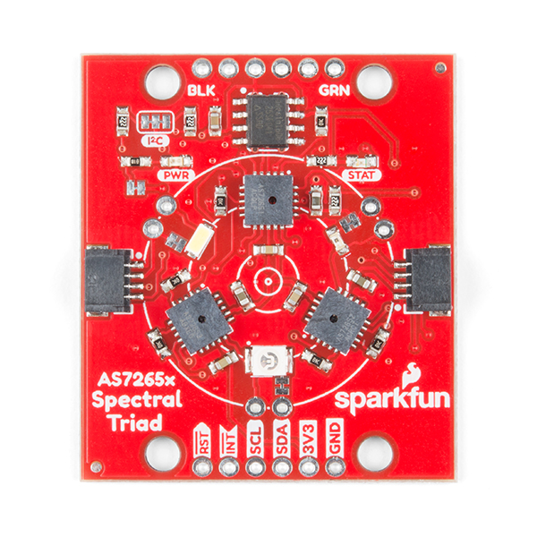

# PETER
(Polyethylene terephthalate Eating Robot)
Science Fair Underwater Submarine Robot 2022 - 2024

Autonomous Robotic Approach to Freshwater Micro-Polyethylene Terephthalate Filtration: Remotely Operated Underwater Vehicle with Random Forest Classifier for Spectrophotometry and Activated Carbon Block for Microfiltration (PETER: PolyEthylene Terephthalate Eating Robot)

[Preprint Paper](https://drive.google.com/file/d/15CNh7rJ7UazrUXL9Ir4DNzf12wgo9ltL/view?usp=sharing)

## About
This repository serves as PoC code for subsystems of an underwater submarine robot.

## Scectral Analysis
 

PETER uses a AS7265x SparkFun Triad Spectroscopy Sensor and Machine Learning to determine the probability that a sample of light in any given moment is PET(E) plastic.
